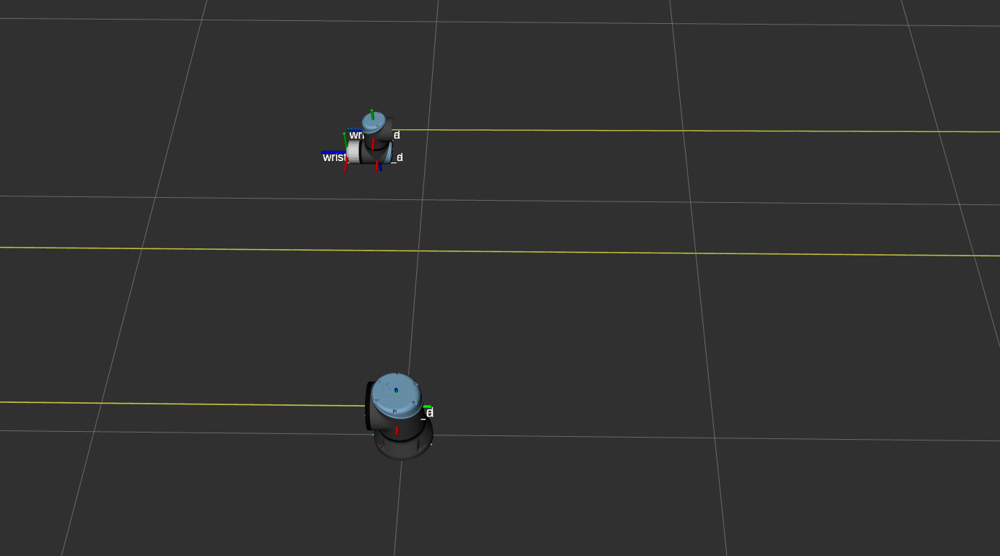
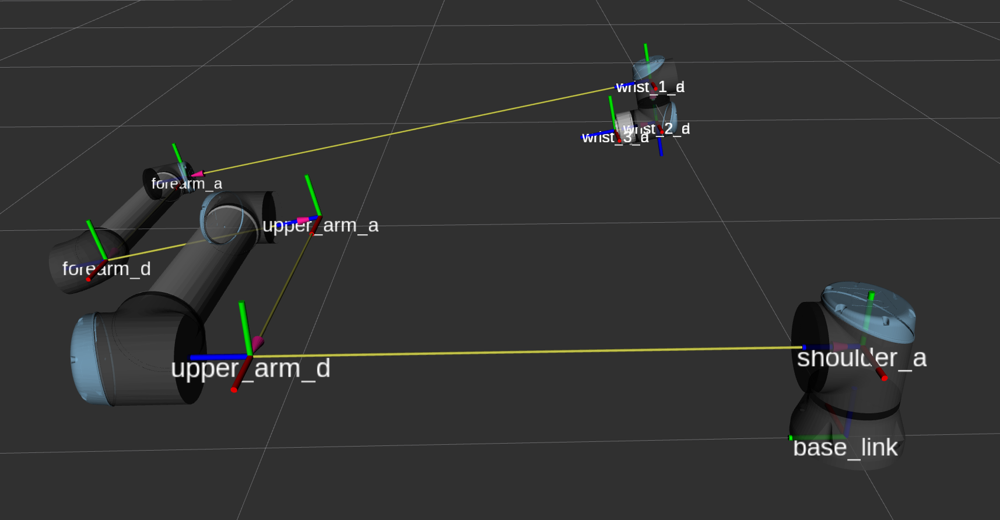
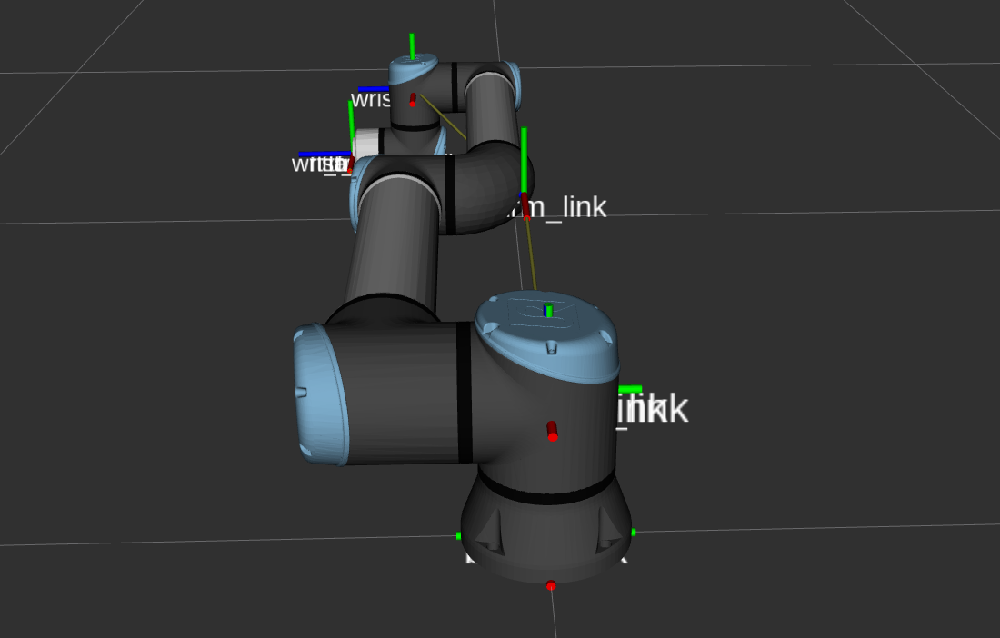

Calibration correction algorithm
================================

When extracting the robot's calibration there will be a set of Denavit–Hartenberg (DH) parameters
describing the robot. Due to the calibration process they can seem a bit unintuitive since the
``d``-parameter of the second and third joint can be quite large on those.

For example, let's consider the following dh parameters taken from a real robot:

.. code-block:: yaml

   #          joint1                  joint2               joint3                joint4               joint5                joint6
   dh_theta: [-2.4147806894359e-07    1.60233952386695     -1.68607190752171     0.0837331147700119   -1.01260355871158e-07 3.91986209186124e-08 ]
   dh_a:     [ 2.12234865571206e-05   0.0193171326277006   -0.569251663611088   -4.61409023720934e-05 -6.39280053471802e-05 0                    ]
   dh_d:     [ 0.180539811714259    439.140974079901     -446.027059806332       7.0603368964236       0.119811341150314    0.115670917257426    ]
   dh_alpha: [ 1.57014608044242       0.0013941666682559    0.00693818880325995  1.56998468543761     -1.57038520649543     0                    ]

One can see that the upper arm is placed 439 m out of the base link with the lower arm being 7 m to
the other side.

We can build a robot description that splits each DH segment into two links: One for ``d`` and
``theta`` representing the rotational part of the joint and one for ``a`` and ``alpha``
representing the "passive" part of the joint displacing the next link.
:numref:`calibration_example` shows (a part of) the description matching the parameters above. The
arm links are left out of the image as they are really far away.

.. _calibration_example:

  This shows an example calibrated model when using the DH parameters directly as explained above.
  The two arm links are virtually displaced very far from the physical robot while the TCP ends up
  at the correct location again

For explaining the correction algorithm, we will use an artificial set of DH parameters for a
UR10e:

.. code-block:: yaml

   #          join1       joint2  joint3  joint4       joint5      joint6
   dh_theta: [0           0       0       0            0           0      ]
   dh_a:     [0          -0.6127 -0.57155 0            0           0      ]
   dh_d:     [0.1807      1       0.5    -1.32585      0.11985     0.11655]
   dh_alpha: [1.570796327 0.2     0       1.570796327 -1.570796327 0      ]

The resulting uncorrected model can be seen in :numref:`calibration_uncorrected`. The upper arm is
placed 1 m to the left of the shoulder, the upper arm is placed 0.5 m further out and there's an
added ``alpha`` rotation in joint2.

Note: This is not a valid calibration, so when placing this "calibration" on a robot and using the
correction, we won't get correct tcp pose results. This only serves as a exaggerated example.

.. _calibration_uncorrected:

  This shows an artificial calibration only to show the algorithm. This is no valid calibration!

In :numref:`calibration_uncorrected` the separation between the two DH components can be seen quite
clearly. joint2's ``d`` and ``theta`` parameters are represented by ``upper_arm_d`` and its ``a``
and ``alpha`` parameters result in ``upper_arm_a``.

The "correction" step tries to bring the two arm segments back to their physical representation.
In principle, the d parameter to zero, first. With this change,
the kinematic structure gets destroyed, which has to be corrected:

- With setting ``d`` to 0, both the start (``upper_arm_d``) and end (``upper_arm_a``) points of the
  passive segment move along the joint's rotational axis. Instead, the end point of the passive
  segment has to move along the rotational axis of the next segment. This requires adapting
  ``a`` and ``theta``, if the two rotational axes are not parallel.

- The length of moving along the next segment's rotational axis is calculated by intersecting
  the next rotational axis with the XY-plane of the moved ``_d`` frame. This gets subtracted from
  the next joint's ``d`` parameter.

Note that the parameters from this model are not strict DH parameters anymore, as the two frames at
the tip of the upper and lower arm have to get an additional rotation to compensate the change of
the arm segment orientation, when the tip is moving along its rotation axis.

The resulting "DH parameters" are then reassembled into six individual transforms that can become
the six frames of the robot's kinematic chain. This is exported in a yaml representation and gets
read by the description package.

Also, no correction of the visual meshes is performed. Strictly speaking, the visual
model is not 100 % correct, but with a calibrated model and ideal meshes this cannot be achieved and
the inaccuracies introduced by this are considered negligible.

The example as visualized in :numref:`calibration_example` looks as follows if a description with
the correct parameters is loaded:

   This shows the model from :numref:`calibration_example` with the calibration correction applied.
   The robot is correctly assembled and the ``base->tool0`` transformation is exactly the same as
   on the robot controller.
