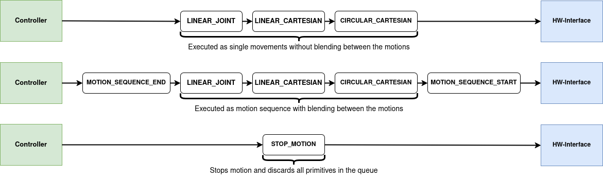

ur_robot_motion_primitives_driver
==========================================

Driver package to control ur robot using motion primitives like LINEAR_JOINT (PTP/ MOVEJ), LINEAR_CARTESIAN (LIN/ MOVEL) and CIRCULAR_CARTESIAN (CIRC/ MOVEC)


# Related packages/ repos
- [generate_parameter_library](https://github.com/PickNikRobotics/generate_parameter_library)
- [industrial_robot_motion_interfaces (with additional helper types for stop and motion sequence)](https://github.com/StoglRobotics-forks/industrial_robot_motion_interfaces/tree/helper-types)
- [motion_primitives_forward_controller from StoglRobotics-forks/ros2_controllers](https://github.com/StoglRobotics-forks/ros2_controllers/tree/motion_primitive_forward_controller/motion_primitives_forward_controller)
- [Universal_Robots_ROS2_Driver from StoglRobotics-forks/Universal_Robots_ROS2_Driver_MotionPrimitive](https://github.com/StoglRobotics-forks/Universal_Robots_ROS2_Driver_MotionPrimitive)
- [Universal_Robots_Client_Library with movec from urfeex](https://github.com/urfeex/Universal_Robots_Client_Library/tree/movec_movep)
 
# Motion Primitives UR Driver

This repository provides a hardware interface for executing motion primitives on a UR robot using the ROS 2 control framework. It allows the controller to execute linear, circular, and joint-based motion commands asynchronously and supports motion sequences for smooth trajectory execution.

## Architecture


## Overview

## Overview

In contrast to the standard UR hardware interface, this driver does not compute or execute trajectories on the ROS 2 side. Instead, it passes high-level motion primitives directly to the robot controller, which then computes and executes the trajectory internally.

This approach offers two key advantages:

- **Reduced real-time requirements** on the ROS 2 side, since trajectory planning and execution are offloaded to the robot.
- **Improved motion quality**, as the robot controller has better knowledge of the robot's kinematics and dynamics, leading to more optimized and accurate motion execution.


### Supported Motion Primitives

- `LINEAR_JOINT` (PTP / MOVEJ)
- `LINEAR_CARTESIAN` (LIN / MOVEL)
- `CIRCULAR_CARTESIAN` (CIRC / MOVEC)
- `MOTION_SEQUENCE_START` and `MOTION_SEQUENCE_END` for motion sequences

Using motion sequences enables blending between multiple primitives for smoother motion profiles.



## write() Method

The `write()` method checks whether a new motion primitive command has been received from the controller via the command interfaces. If a new command is present:

1. If the command is `STOP_MOTION`, a flag is set which leads to interrupting the current motion inside the `asyncStopMotionThread()`.
2. For other commands, they are passed to the `asyncCommandThread()` and executed asynchronously.

Threading is required since calls to the Instruction Executor are blocking. Offloading these to separate threads ensures the control loop remains responsive during motion execution. The stopping functionality is also threaded to allow interrupting a primitive even during execution or in a motion sequence.

## read() Method

The `read()` method:

- Publishes the `execution_status` over a state interface with possible values: `IDLE`, `EXECUTING`, `SUCCESS`, `ERROR`.
- Publishes `ready_for_new_primitive` over a state interface to signal whether the interface is ready to receive a new primitive.
- Handles additional state interfaces adopted from the UR driver, such as joint states, enabling RViz to visualize the current robot pose.

## UR Driver Conflict

The standard UR hardware interface cannot run in parallel with this motion primitives interface due to connection conflicts. To resolve this:

- The state interface functionality from the UR hardware interface was refactored into a helper header: `ur_state_helper.hpp`.
- This helper enables code reuse between the standard hardware interface and the `motion_primitives_ur_driver`, ensuring robot state data is still available.


# Usage notes
## Launch "normal" ur driver
```
ros2 launch ur_robot_driver ur_control.launch.py ur_type:=ur5e robot_ip:=172.20.0.2 launch_rviz:=true
```
## Launch motion_primitives_ur_driver
```
ros2 launch ur_robot_driver motion_primitive_controller_ur.launch.py ur_type:=ur5e robot_ip:=172.20.0.2 launch_rviz:=true
```
## Publish dummy commands
```
ros2 run ur_robot_driver send_dummy_motion_primitives.py
```
## Publish stop motion command 
```
ros2 topic pub /motion_primitive_controller/reference industrial_robot_motion_interfaces/msg/MotionPrimitive "{type: 66, blend_radius: 0.0, additional_arguments: [], poses: [], joint_positions: []}" --once

```

## Start UR-Sim
```
docker run --rm -it universalrobots/ursim_e-series
```

## Enable Remote Control on UR
Remote control needs to be enabled:
https://robodk.com/doc/en/Robots-Universal-Robots-How-enable-Remote-Control-URe.html


# TODO's
- if trajectory is finished while `instruction_executer->cancelMotion()` is called --> returns with execution_status ERROR --> no new command can be sent to hw-interface --> need to call `instruction_executer->cancelMotion()` a second time
- for the motion primitive driver `ur_joint_control.xacro` without command interfaces is needed: `motion_primitive_ur_joint_control.xacro` --> is there a better way than a copy of the file with commented command interfaces?

# Useful sources
- https://rtw.b-robotized.com/master/use-cases/ros_workspaces/aliases.html
- https://control.ros.org/master/doc/ros2_control/ros2controlcli/doc/userdoc.html
- ...