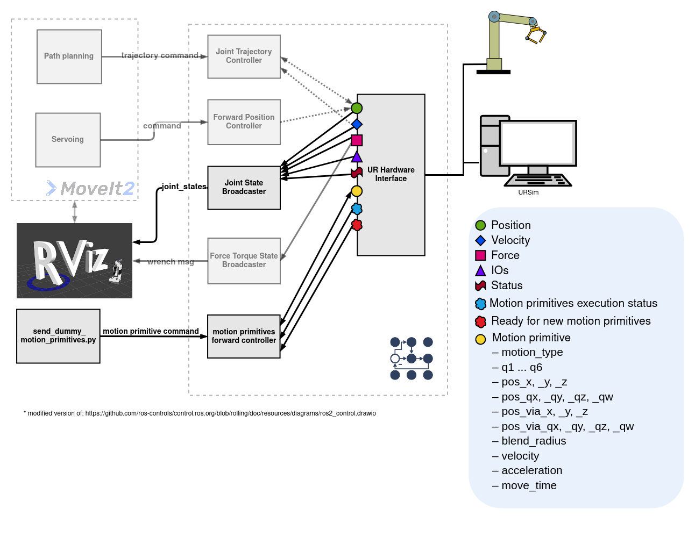

motion_primitives_ur_driver
==========================================

# TODO(mathias31415): Readme anpassen --> motion_primitive_ur_driver wurde in hardware_interface integriert

Hardware interface for executing motion primitives on a UR robot using the ROS 2 control framework. It allows the controller to execute linear (LINEAR_CARTESIAN/ LIN/ MOVEL), circular (CIRCULAR_CARTESIAN/ CIRC/ MOVEC), and joint-based (LINEAR_JOINT/ PTP/ MOVEJ) motion commands asynchronously and supports motion sequences for smooth trajectory execution.


# Demo Video with URSim
[](https://www.youtube.com/watch?v=htUJtfkgr6Q)

# Related packages/ repos
- [industrial_robot_motion_interfaces (with additional helper types for stop and motion sequence)](https://github.com/StoglRobotics-forks/industrial_robot_motion_interfaces/tree/helper-types)
- [ros2_controllers with motion_primitives_forward_controller](https://github.com/StoglRobotics-forks/ros2_controllers/tree/motion_primitive_forward_controller/motion_primitives_forward_controller)
- [Universal_Robots_ROS2_Driver with motion_primitive_ur_driver](https://github.com/StoglRobotics-forks/Universal_Robots_ROS2_Driver_MotionPrimitive)
- [Universal_Robots_Client_Library](https://github.com/UniversalRobots/Universal_Robots_Client_Library)


# Architecture



# Command and State Interfaces

The `motion_primitives_ur_driver` hardware interface defines a set of **command interfaces** and **state interfaces** used for communication between the controller and the robot hardware.

## Command Interfaces

These interfaces are used to send motion primitive data to the hardware interface:

- `motion_type`: Type of motion primitive (e.g., LINEAR_JOINT, LINEAR_CARTESIAN, CIRCULAR_CARTESIAN, etc.)
- `q1` – `q6`: Target joint positions for joint-based motion
- `pos_x`, `pos_y`, `pos_z`: Target Cartesian position
- `pos_qx`, `pos_qy`, `pos_qz`, `pos_qw`: Orientation quaternion of the target pose
- `pos_via_x`, `pos_via_y`, `pos_via_z`: Intermediate via-point position for circular motion
- `pos_via_qx`, `pos_via_qy`, `pos_via_qz`, `pos_via_qw`: Orientation quaternion of via-point
- `blend_radius`: Blending radius for smooth transitions
- `velocity`: Desired motion velocity
- `acceleration`: Desired motion acceleration
- `move_time`: Optional duration for time-based execution (For LINEAR_JOINT and LINEAR_CARTESIAN. If move_time > 0, velocity and acceleration are ignored)

## State Interfaces

These interfaces are used to communicate the internal status of the hardware interface back to the controller:

- `execution_status`: Indicates the current execution state of the primitive. Possible values are:
  - `IDLE`: No motion in progress
  - `EXECUTING`: Currently executing a primitive
  - `SUCCESS`: Last command finished successfully
  - `ERROR`: An error occurred during execution
  - `STOPPED`: The robot was stopped using the `STOP_MOTION` command and must be reset with the `RESET_STOP` command before executing new commands.
- `ready_for_new_primitive`: Boolean flag indicating whether the interface is ready to receive a new motion primitive

In addition to these, the driver also provides all standard state interfaces from the original UR hardware interface (e.g., joint positions, velocities). These are used by components like the `joint_state_broadcaster` and allow tools like RViz to visualize the current robot state.


# Supported Motion Primitives

- Support for basic motion primitives:
  - `LINEAR_JOINT`
  - `LINEAR_CARTESIAN`
  - `CIRCULAR_CARTESIAN`
- Additional helper types:
  - `STOP_MOTION`: Immediately stops the current robot motion and clears all pending primitives in the controller's queue.
  - `RESET_STOP`: After `RESET_STOP`, new commands can get handled.
  - `MOTION_SEQUENCE_START` / `MOTION_SEQUENCE_END`: Define a motion sequence block. All primitives between these two markers will be executed as a single, continuous sequence. This allows seamless transitions (blending) between primitives.


# Overview

In contrast to the standard UR hardware interface, this driver does not compute or execute trajectories on the ROS 2 side. Instead, it passes high-level motion primitives directly to the robot controller, which then computes and executes the trajectory internally.

This approach offers two key advantages:

- **Reduced real-time requirements** on the ROS 2 side, since trajectory planning and execution are offloaded to the robot.
- **Improved motion quality**, as the robot controller has better knowledge of the robot's kinematics and dynamics, leading to more optimized and accurate motion execution.


## write() Method

The `write()` method checks whether a new motion primitive command has been received from the controller via the command interfaces. If a new command is present:

1. If the command is `STOP_MOTION`, a flag is set which leads to interrupting the current motion inside the `asyncStopMotionThread()`. If the command is `RESET_STOP`, the flag is reset, and new motion primitives can be received and executed.
2. For other commands, they are passed to the `asyncCommandThread()` and executed asynchronously. Individual primitives are executed directly via the Instruction Executor.
If a `MOTION_SEQUENCE_START` command is received, all subsequent primitives are added to a motion sequence. Once `MOTION_SEQUENCE_END` is received, the entire sequence is executed via the Instruction Executor.

Threading is required since calls to the Instruction Executor are blocking. Offloading these to separate threads ensures the control loop remains responsive during motion execution. The stopping functionality is also threaded to allow interrupting a primitive even during execution or in a motion sequence.

## read() Method

The `read()` method:

- Publishes the `execution_status` over a state interface with possible values: `IDLE`, `EXECUTING`, `SUCCESS`, `ERROR`, `STOPPED`.
- Publishes `ready_for_new_primitive` over a state interface to signal whether the interface is ready to receive a new primitive.
- Handles additional state interfaces adopted from the UR driver, such as joint states, enabling RViz to visualize the current robot pose.

## UR Driver Conflict

The standard UR hardware interface cannot run in parallel with this motion primitives interface due to connection conflicts. To resolve this:

- The state interface functionality from the UR hardware interface was refactored into a helper header: `ur_state_helper.hpp`.
- This helper enables code reuse between the standard hardware interface and the `motion_primitives_ur_driver`, ensuring robot state data is still available.


# Example usage notes with UR10e
## (optional) URSim
Start UR-Sim according to the [Universal Robots ROS 2 Driver Documentation](https://docs.universal-robots.com/Universal_Robots_ROS2_Documentation/doc/ur_client_library/doc/setup/ursim_docker.html) or the [Documentation for universalrobots/ursim_e-series docker container](https://hub.docker.com/r/universalrobots/ursim_e-series)
```
ros2 run ur_client_library start_ursim.sh -m ur10e
```
Remote control needs to be enabled:
https://robodk.com/doc/en/Robots-Universal-Robots-How-enable-Remote-Control-URe.html

## Launch hardware_interface with motion_primitives_ur_driver
With URSim:
```
ros2 launch ur_robot_driver ur_control.launch.py ur_type:=ur10e robot_ip:=192.168.56.101 launch_rviz:=true headless_mode:=true initial_joint_controller:=motion_primitive_controller
```
With H-KA UR10e:
```
ros2 launch ur_robot_driver ur_control.launch.py ur_type:=ur10e robot_ip:=192.168.1.102 launch_rviz:=true headless_mode:=true initial_joint_controller:=motion_primitive_controller
```
## Switching control mode
```
ros2 control switch_controllers --activate motion_primitive_controller --deactivate scaled_joint_trajectory_controller
```
## Publish dummy commands
> [!WARNING]  
> Ensure that the robot in your configuration is able to execute these motion primitives without any risk of collision.
```
ros2 run ur_robot_driver send_dummy_motion_primitives_hka_ur10e.py
```
## Publish stop motion command
```
ros2 topic pub /motion_primitive_controller/reference industrial_robot_motion_interfaces/msg/MotionPrimitive "{type: 66, blend_radius: 0.0, additional_arguments: [], poses: [], joint_positions: []}" --once
```
## Reset stop motion command
```
ros2 topic pub /motion_primitive_controller/reference industrial_robot_motion_interfaces/msg/MotionPrimitive "{type: 67, blend_radius: 0.0, additional_arguments: [], poses: [], joint_positions: []}" --once
```

# TODO's
- if trajectory is finished while `instruction_executer->cancelMotion()` is called --> returns with execution_status ERROR --> no new command can be sent to hw-interface --> need to call `instruction_executer->cancelMotion()` a second time
- for the motion primitive driver `ur_joint_control.xacro` without command interfaces is needed: `motion_primitive_ur_joint_control.xacro` --> is there a better way than a copy of the file with commented command interfaces?

# Useful sources
- https://docs.universal-robots.com/Universal_Robots_ROS_Documentation/doc/ur_client_library/doc/architecture/instruction_executor.html
- https://docs.universal-robots.com/Universal_Robots_ROS_Documentation/doc/ur_client_library/doc/examples/instruction_executor.html
- https://rtw.b-robotized.com/master/use-cases/ros_workspaces/aliases.html
- https://control.ros.org/master/doc/ros2_control/ros2controlcli/doc/userdoc.html
- ...


# With MoveIt and Pilz-Planner
**Mock Hardware**
```
ros2 launch ur_robot_driver ur_control.launch.py ur_type:=ur5e robot_ip:=172.20.0.2  use_mock_hardware:=true initial_joint_controller:=scaled_joint_trajectory_controller launch_rviz:=false
```
**Simulation**
```
ros2 launch ur_robot_driver ur_control.launch.py ur_type:=ur10e robot_ip:=192.168.56.101 initial_joint_controller:=scaled_joint_trajectory_controller launch_rviz:=true
```
**H-KA UR10e**
```
ros2 launch ur_robot_driver ur_control.launch.py ur_type:=ur10e robot_ip:=192.168.1.102 initial_joint_controller:=scaled_joint_trajectory_controller launch_rviz:=false
```
**Using MoveIt**
https://docs.universal-robots.com/Universal_Robots_ROS2_Documentation/doc/ur_robot_driver/ur_robot_driver/doc/usage/move.html#start-hardware-simulator-or-mockup
```
ros2 launch ur_moveit_config ur_moveit.launch.py ur_type:=ur5e launch_rviz:=true
```

```
ros2 run ur_robot_driver send_joint_positions.py
```

