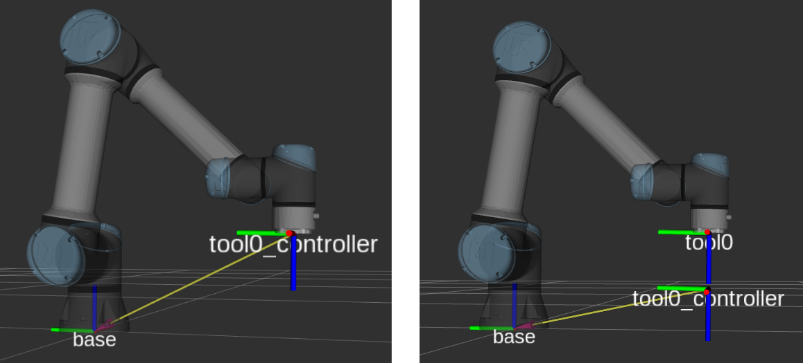

:github_url: https://github.com/UniversalRobots/Universal_Robots_ROS2_Driver/blob/main/ur_robot_driver/doc/utility_controllers.rst

.. _utility_controllers:

Utility Controllers
===================

These controllers provide access to UR robot-specific features that complement the motion control
modes. They are not motion controllers themselves but provide status information, safety features,
and special robot modes.

For position and velocity based control, see :ref:`position_velocity_control`.

For force and torque based control, see :ref:`force_torque_control`.

speed_scaling_state_broadcaster
-------------------------------

Type: :ref:`ur_controllers/SpeedScalingStateBroadcaster <speed_scaling_state_broadcaster>`

Publishes the current actual execution speed as reported by the robot. Values are floating points
between 0 and 1. This broadcaster is read-only and can run alongside any other controller.

The speed scaling value reflects the combined effect of the speed slider on the teach pendant and
any controller-imposed speed limits. It is used by the ``joint_trajectory_controller`` to scale
trajectory execution on the ROS PC. For the ``passthrough_trajectory_controller`` and the
``motion_primitive_forward_controller``, speed scaling is handled directly by the robot controller
since it performs the interpolation in these modes.

io_and_status_controller
------------------------

Type: :ref:`ur_controllers/GPIOController <io_and_status_controller>`

Allows setting I/O ports, controlling some UR-specific functionality, and publishes status
information about the robot. This controller is always active.

Key services include:

* ``~/set_io``: Set digital output pins.
* ``~/set_payload``: Change the robot's payload on-the-fly.
* ``~/set_speed_slider``: Set the speed slider value.
* ``~/zero_ftsensor``: Zero the force/torque sensor.
* ``~/resend_robot_program``: Restart the external control program (:ref:`headless mode <headless_mode>`).

See the :ref:`io_and_status_controller <io_and_status_controller>` documentation for the full list
of topics and services.

tool_contact_controller
-----------------------

Type: :ref:`ur_controllers/ToolContactController <tool_contact_controller>`

Enables the robot's tool contact detection. When tool contact is detected, the robot stops all
motion and retracts to where it first sensed the contact. This is useful for probing, surface
detection, and safe approach applications.

The controller works with the ``joint_trajectory_controller`` and the
``passthrough_trajectory_controller``.

The controller provides an action interface:

* ``~/detect_tool_contact [ur_msgs/action/ToolContact]``

.. code-block:: console

   $ ros2 action send_goal /tool_contact_controller/detect_tool_contact \
     ur_msgs/action/ToolContact

See the :ref:`tool_contact_controller <tool_contact_controller>` documentation for full details.

tcp_pose_broadcaster
--------------------

Type: `pose_broadcaster/PoseBroadcaster <https://control.ros.org/rolling/doc/ros2_controllers/pose_broadcaster/doc/userdoc.html>`_

Publishes the robot's TCP pose. This broadcaster is read-only and can run alongside any other
controller.

The robot's TCP pose is published both as a ``geometry_msgs/PoseStamped`` on the ``tcp_pose_broadcaster/pose`` topic and as a
``tf2`` transform with the frame name ``tool0_controller`` with ``base`` as a
parent.

Thus, the transformation from ``base`` to ``tool0_controller`` doesn't use the URDF model and
forward kinematics in ROS, but instead directly uses the robot's internal kinematics and sensors
(which will always use the robot's calibration).

.. note::
   When setting a tool on the robot's teach pendant, this will affect the tcp pose as published by
   this controller, as the robot will take the tool's geometry into account when calculating the
   TCP pose.

   Setting up the :ref:`URDF with the robot's calibration <ur_calibration>` will make the ``tool0``
   and ``tool0_controller`` frames align exactly given no tool is setup on the robot.

   All frames mentioned will be prefixed with the robot's ``tf_prefix`` if it is set. It has been
   omitted here for readability.

   The ``tool0_controller`` frame is published with ``base`` as parent directly, while
   ``tool0`` is attached to the URDF model chain. When a TCP is setup on the robot, the
   ``tool0_controller`` frame will take that into account (as on the right, where the tool has a
   z-offset of 110 mm).

ur_configuration_controller
----------------------------

Type: :ref:`ur_controllers/URConfigurationController <ur_configuration_controller>`

Provides access to UR-specific robot configuration data. This controller is always active.
