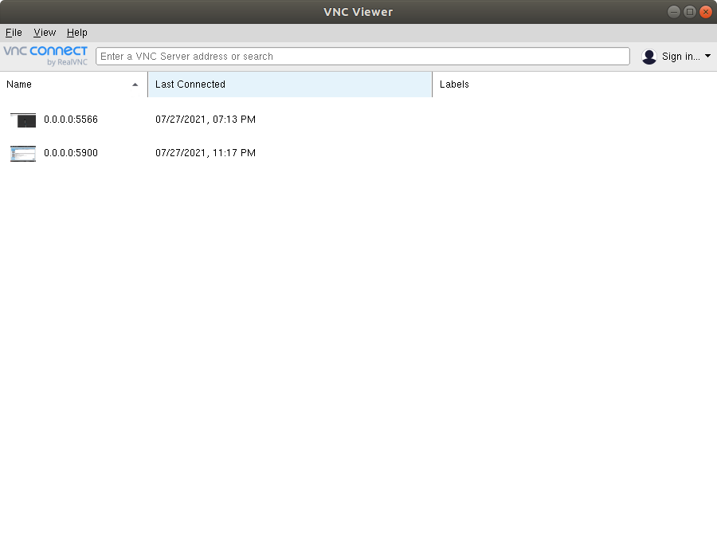

# Docker support for Universal Robots ROS2 Driver and URsim

## Prerequisites
- Download [vncviewer](https://www.realvnc.com/en/connect/download/viewer/) from the official site.
- Install [Docker Engine](https://docs.docker.com/engine/install/ubuntu/) and [Docker Compose](https://docs.docker.com/compose/install/).

## Driver and URsim
Driver and URsim can be run together by following command  which will build necessary docker images and start the containers.
With appropriate arguments set the ROS2 distro and the Moveit2! build is required.
Run following command in `ur_robot_driver/resources/ursim_driver` folder of this package.
```
ROS2_DISTRO=foxy BUILD_MOVEIT2=0 docker-compose up --build
```


Start vncviewer by typing `vncviewer` in the terminal. When the containers are up and running, you should be
able to see active connections. Use 0.0.0.0:5900 for ursim and 0.0.0.0:5566 for driver connection.

 

 Open the URsim vnc connection to see the simulator window.\
