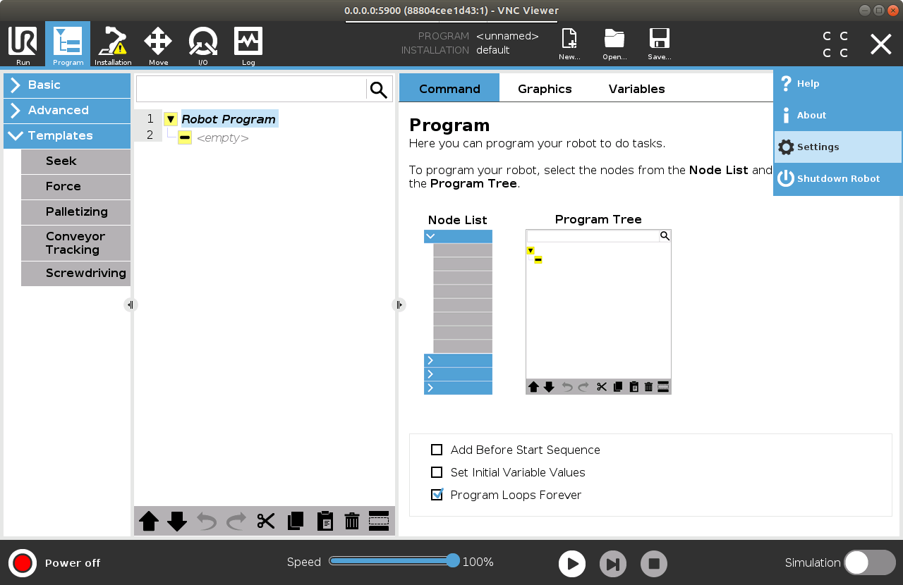
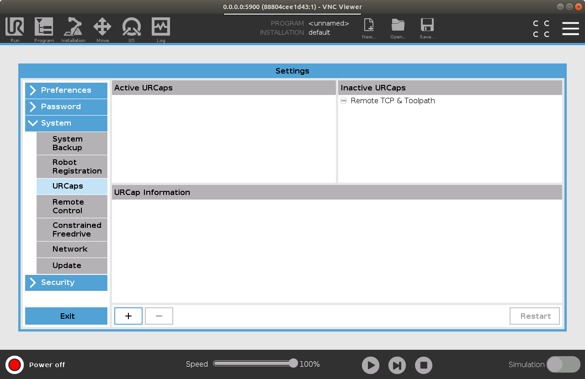
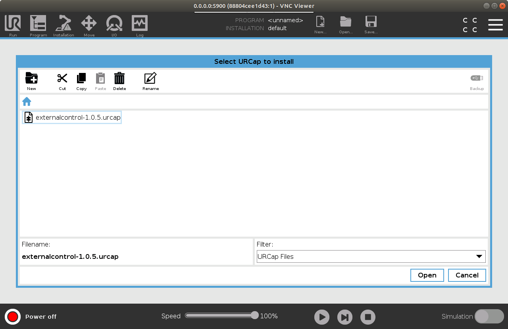
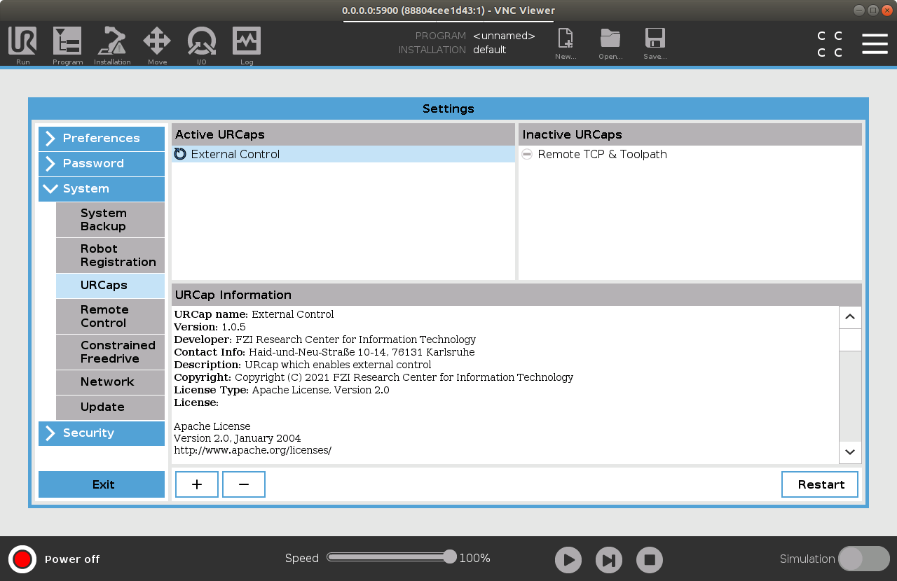
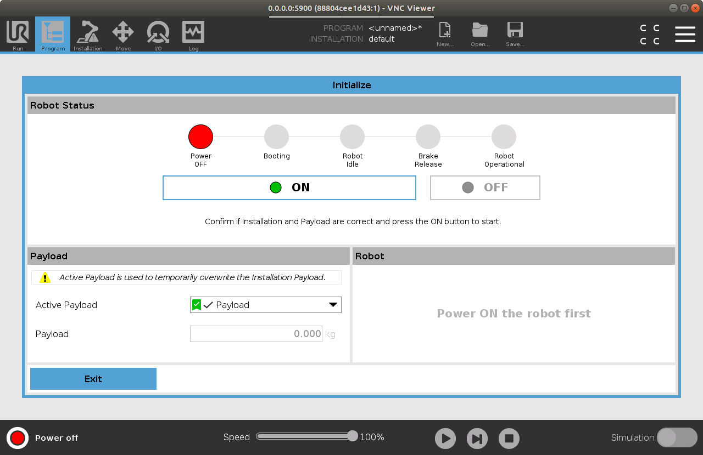
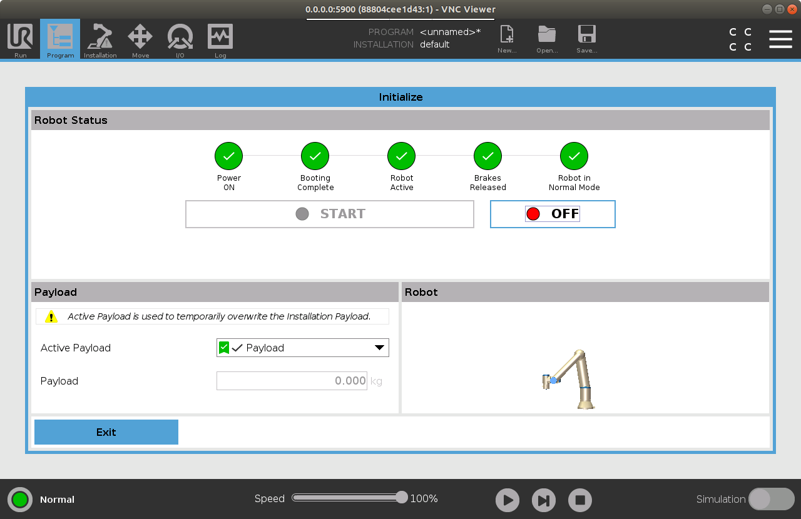
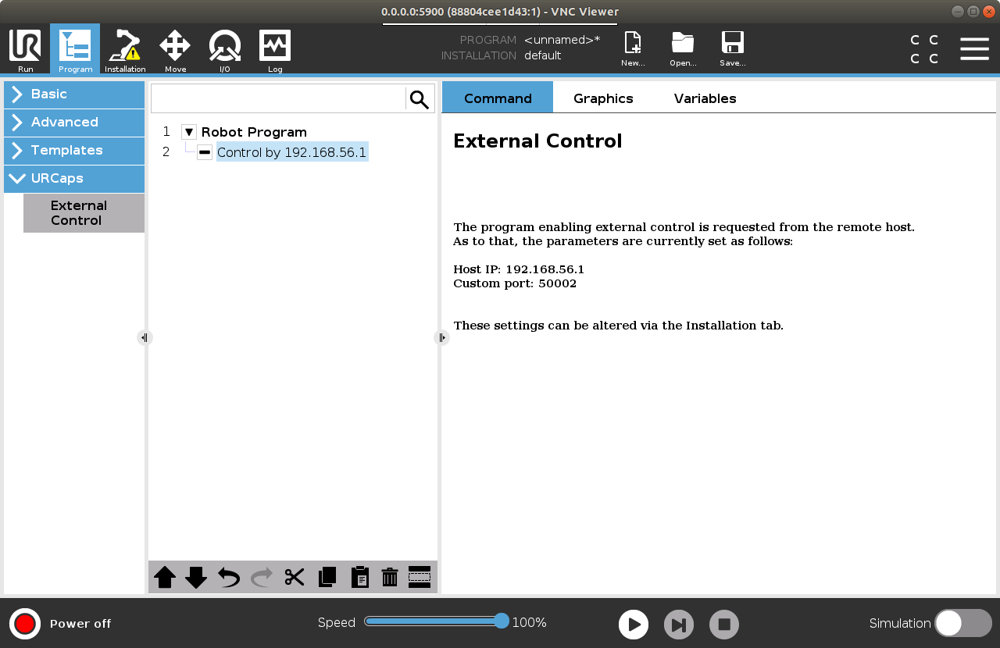
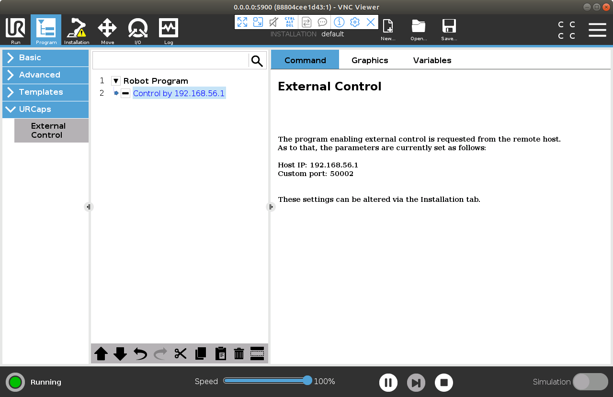
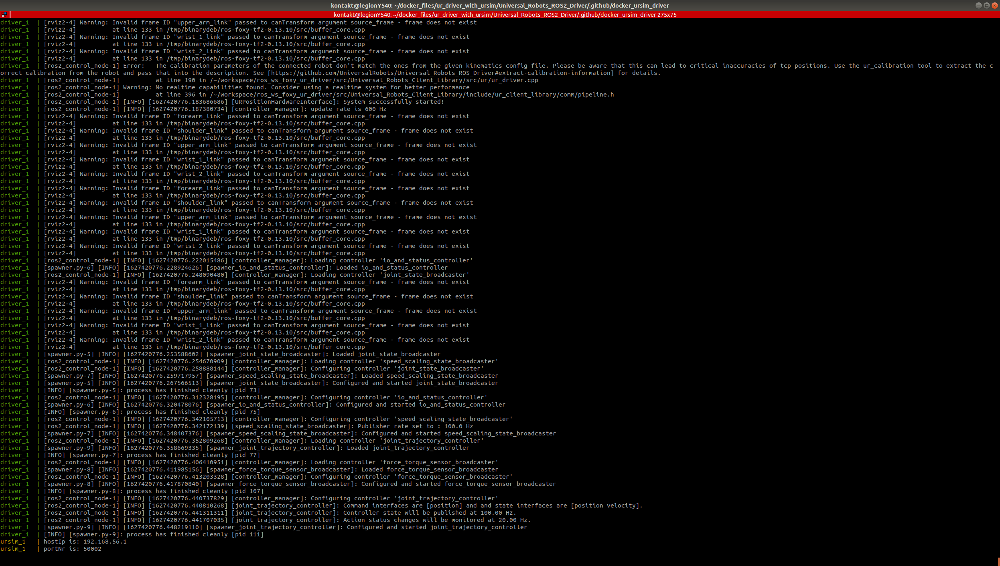

# Docker support for Universal Robots ROS2 Driver and URsim

## Prerequisites
- Download [vncviewer](https://www.realvnc.com/en/connect/download/viewer/) from the official site.
- Install [Docker Engine](https://docs.docker.com/engine/install/ubuntu/) and [Docker Compose](https://docs.docker.com/compose/install/).

## Driver and URsim
Driver and URsim can be run together by following command  which will build necessary docker images and start the containers.
```
docker-compose up
```


Start vncviewer by typing `vncviewer` in the terminal. When the containers are up and running, you should be 
able to see active connections. Use 0.0.0.0:5900 for ursim and 0.0.0.0:5566 for driver connection.
 
 
 
 Open the URsim vnc connection to install necessary urcap via settings tab.
 
 
 
 Navigate to URCaps menu.
 
 

 Add new urcap for external control option for UR robots. After selection click Open.
 
 
 
 When the urcap is successfully added the simulator must be restarted.
 
 Open new terminal and enter:
```
  docker restart ursimdriver_ursim_1
```
 

 
Reopen ursim connection and power on the robot by clicking the bottom left red button.
 

  
Click ON and after that START button. When the robot is powered on all the LEDs should be green.
  


Add the urcap for external control as active program in the Program tab.



Reconnect the driver by restarting its container.
```
  docker restart ursimdriver_driver_1
```
When the driver container is up and running again click play button in the simulator app. Successful connection
will result with the following app status and report:





## Driver only
...


 
